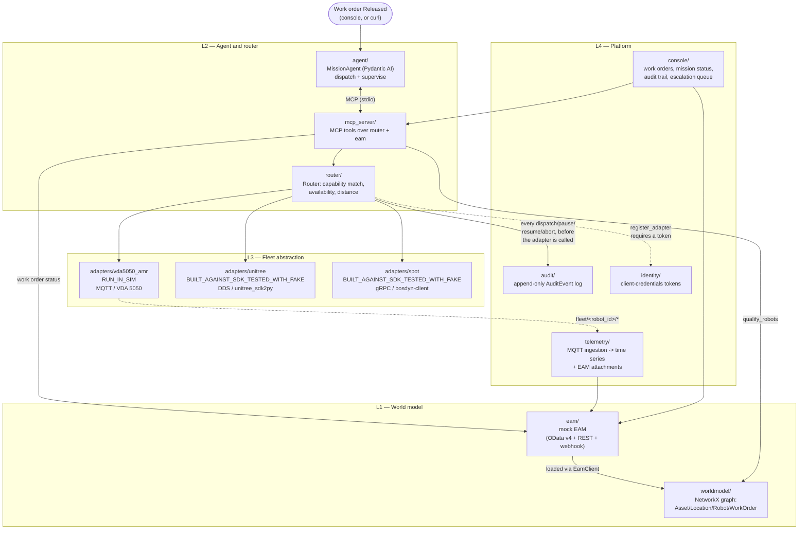

# Architecture

Four layers (CLAUDE.md section 3). This describes what's actually built,
by build-sequence step, not an aspirational diagram — where a box below
doesn't correspond to a real module, it says so.

## Reading the diagram

- **Solid arrows** are wired and tested. **Dashed arrows** mark the
  parts of a real deployment that either aren't exercised end to end
  yet (VDA5050 → telemetry: the ingestion path is tested with a
  synthetic MQTT publish in `telemetry/tests/`, not the real
  `ros2_bridge` publishing) or are optional (`register_adapter`'s
  identity check only runs if a `Router` is constructed with an
  `IdentityService` — the demo wiring in `mcp_server/wiring.py`
  doesn't pass one, so `FakeAdapter`s register unauthenticated; the
  check itself is real and tested in `router/tests/` and
  `identity/tests/`).
- **The agent never talks to `router`, `worldmodel`, or `eam` directly.**
  Every one of its capabilities goes through the eleven MCP tools in
  `mcp_server/tools.py`. This is the one hard architectural boundary
  enforced by *what gets imported*, not just convention —
  `agent/mission_agent.py` literally has no `import router` anywhere.
- **`adapters/` never imports `router` back the other way either** — a
  `FleetAdapter` is a plain Python protocol (`router/models.py`); the
  router holds the adapters, not the reverse. Swapping or adding a
  fourth ecosystem means writing one adapter module and one line in
  wiring; nothing else changes.
- **`mcp_server` runs twice, as two unconnected processes, in the
  current deployment (`deploy/docker-compose.yml`, step 13):** once as
  a long-running HTTP service the console talks to
  (`mcp_server/http_api.py`), and once as a stdio subprocess the agent
  spawns fresh per CLI invocation (`agent/__main__.py` →
  `mcp_toolset()`). Each has its **own in-memory `Router`** — a mission
  the agent dispatches through its subprocess will not show as
  in-progress in the console, which is reading the HTTP process's
  Router. The two share an audit database file (a Docker volume) so
  the audit trail stays consistent even though live mission status
  doesn't. This is documented plainly in `mcp_server/server.py`'s
  module docstring and is the single biggest gap between "each piece
  works" and "the whole system behaves as one coherent service" — see
  "What a real deployment still needs" below.
- **The punchline the whole thing is built to demonstrate**: the EAM
  never has to know which robot did the work. `eam/` has no column, no
  field, nothing that names `vda5050_amr` or `unitree` or `spot` — a
  work order just moves through its status machine
  (`Draft → Released → Dispatched → InProgress → …`). The robot
  identity lives entirely in `router`'s adapter registry and
  `worldmodel`'s graph.

## The four layers, in the order CLAUDE.md section 3 states them

**L1 — World model.** `eam/` is a mock of the business system: work
orders, assets, locations, robot capability descriptors, over OData v4
(the dialect a real enterprise asset-management suite would expose) and
plain REST. `worldmodel/` turns that into a graph
(`Asset -LOCATED_AT-> Location`, `Robot -HAS_CAPABILITY-> Capability`,
`WorkOrder -REQUIRES-> Capability`, `Location -REACHABLE_FROM->
Location`) and answers exactly the question the agent needs: for this
work order, which robots qualify, and by what distance. This is the
one piece of the repo explicitly called out (section 4.2) as the
"productisable asset" — everything downstream is demo-scoped, but a
real integration would keep exactly this layer.

**L2 — Agent and router.** The agent (`agent/`, Pydantic AI) reads a
released work order, resolves it against the world model, dispatches a
mission, and supervises it to completion or escalation — as two
separate `agent.run()` calls (dispatch, then supervise), not one, so a
process restart mid-mission has a real resume point
(`agent/state.py`). It reaches all of this only through MCP tools
(`mcp_server/`), never touching the router directly. The router
(`router/`) treats every executor — a robot adapter, in this repo;
conceivably a human technician or another software agent in a fuller
build — as the same abstraction: register a `FleetAdapter`, and
`dispatch()` picks the cheapest idle, capable, reachable one, auditing
*why* before the adapter is ever called.

**L3 — Fleet abstraction.** One `Mission` schema, one `FleetAdapter`
protocol (`capabilities`, `dispatch`, `status`, `pause`, `resume`,
`abort`, `telemetry_stream`), one adapter module per robot ecosystem.
The three built here land at three different points on the same
honesty scale: `adapters/vda5050_amr` actually runs in Gazebo
(`RUN_IN_SIM` for the MQTT/protocol half; see
`adapters/vda5050_amr/ros2_bridge/README.md` and ADR-005 for exactly
how far the ROS 2 side got); `adapters/unitree` and `adapters/spot` are
both `BUILT_AGAINST_SDK_TESTED_WITH_FAKE` — real vendor SDK, real wire
protocol (DDS RPC / gRPC), fake robot on the other end, because neither
vendor publishes a simulator this repo's laptop can run their
high-level API against.

**L4 — Platform.** `audit/` is a literally append-only log — no
update or delete method exists on `SqliteAuditSink` at all — recording
every dispatch decision and every pause/resume/abort command, with the
work order and mission id it correlates to (`router/router.py` records
these; step 10 fixed a gap where pause/resume/abort weren't carrying
the work order id at all, breaking that correlation for exactly the
degraded-mode scenario section 4.7 asks for). `identity/` is a minimal
stdlib HS256 token issuer standing in for a real OIDC provider (ADR-004
says why: this repo would rather be honest about not running Keycloak
than half-integrate one). `telemetry/` ingests MQTT state/image/event
messages into a time-series sqlite store and attaches images to the
EAM. `console/` is the thin operator UI over all of it.

## What a real deployment still needs

Stated plainly, the way the honesty rule asks for:

- **One long-running `mcp_server`, not two.** The agent should connect
  to the same persistent MCP server process the console talks to
  (over HTTP or an MCP transport that isn't "spawn a fresh subprocess
  per CLI run"), so Router state — which robot is doing what, right
  now — is the same answer no matter who's asking. This is the
  concrete next step implied by `agent/state.py`'s own docstring
  ("real adapters and that deployment shape start at step 7+") and
  `mcp_server/server.py`'s docstring (added at step 13, once actually
  trying to deploy the two processes together surfaced the gap).
- **An automatic trigger for the agent.** `eam/webhooks.py` can POST to
  a subscriber URL when a work order is released; nothing in this repo
  subscribes to it. Today, processing a released work order is a
  manual step (`agent/__main__.py`, or `deploy/k3d/agent-job.yaml`).
  A real deployment wires the webhook (or a lightweight poller) to
  that same entrypoint.
- **The Nav2/Gazebo loop finished**, per ADR-005: booting and spawning
  are proven, driving to a goal through the VDA 5050 bridge node is
  not, given the remaining time budget when that investigation was
  time-boxed.
